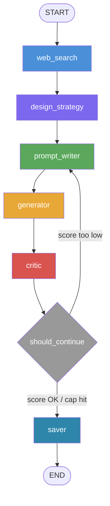

# YouTube Thumbnail Designer Reflexion Agent

This project builds a compiled LangGraph state machine that searches for thumbnail hooks, writes a DALL-E 3 prompt, generates a 16:9 thumbnail, critiques it with GPT-4o vision structured output, and loops until the rating reaches the target or the iteration cap is hit.

## Architecture

The graph follows the reference reflexion pattern:



Required pieces are split across:

- `state.py`: `ThumbnailState` TypedDict with `history: Annotated[..., operator.add]`
- `prompts.py`: design strategy, prompt writer, and critic instructions
- `tools.py`: one Tavily search wrapper
- `nodes.py`: six worker nodes plus the `should_continue` routing node/function
- `graph.py`: `StateGraph`, `START`, `END`, `add_node`, `add_conditional_edges`, and plain `compile()`
- `main.py`: CLI entry point
- `make_diagram.py`: writes `graph.png` from `graph.get_graph().draw_mermaid_png()`

The generator calls DALL-E 3 first with `size="1792x1024"`. If the active OpenAI account rejects `dall-e-3`, it falls back once to the reference repo's `gpt-image-1` pattern so the compiled graph can still finish and produce the assignment outputs.

## Setup

Create `.env`:

```bash
OPENAI_API_KEY=...
TAVILY_API_KEY=...
```

Install dependencies:

```bash
uv sync
```

Run the default topic:

```bash
uv run python main.py
```

Run a custom topic:

```bash
uv run python main.py "Why Python is the best language for AI" --target-rating 8 --max-iterations 3
```

Generate the graph diagram:

```bash
uv run python make_diagram.py
```

Each run writes:

`outputs/<timestamp>_<topic>/iter_N.png`, `final.png`, and `report.md`.

## References Indexed

- https://github.com/fnusatvik07/agentbuilder-assignment1
- https://github.com/alampallysainath8/Langgraph_reflexion_agent
- https://docs.langchain.com/oss/python/langgraph/overview

The LangGraph reflexion reference repo was cloned and indexed locally at `.codex_refs/Langgraph_reflexion_agent` during implementation.
