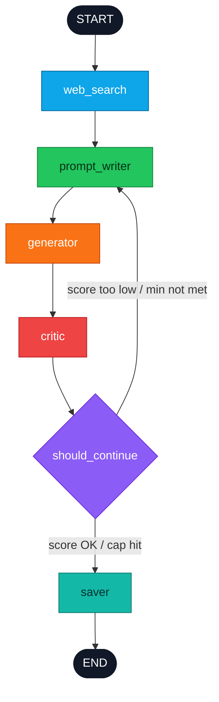

# YouTube Thumbnail Designer Reflexion Agent

This project builds a compiled LangGraph reflexion agent for YouTube thumbnail generation. It searches the web once with Tavily, writes an image prompt, generates thumbnails with `gpt-image-1`, critiques each image with GPT-4o vision, loops through revisions, and saves the best thumbnail plus a full report.

## What This Agent Does

This is a YouTube Thumbnail Designer that designs a thumbnail for a given video topic, then keeps improving it through self-criticism until the thumbnail is good enough or the iteration cap is reached.

For a topic like:

```text
Why Python is the best language for AI
```

the agent:

1. Searches the web once for hooks, visual angles, and reference context.
2. Writes a detailed image prompt for a clickable 16:9 YouTube thumbnail.
3. Generates a thumbnail image with `gpt-image-1`.
4. Critiques the generated image with GPT-4o vision.
5. Feeds the critique back into the next prompt.
6. Repeats the prompt/generate/critic loop.
7. Saves the best image as `final.png`.
8. Writes `report.md` with every iteration, prompt, score, critique, and image reference.

This is the reflexion pattern: the agent observes its own output, criticizes it, and uses that feedback to improve the next attempt.

## High-Level Architecture

The application is built as a compiled LangGraph state machine. The graph owns the complete control flow, including the improvement loop. There is no external Python `while` loop controlling retries.

Each node receives the shared `ThumbnailState` and returns a small dictionary of updates. LangGraph merges those updates into the state and moves to the next node.

The most important state fields are:

- `topic`: the user-provided video topic.
- `search_summary`: one-time Tavily research for hooks and visual ideas.
- `current_prompt`: the latest image-generation prompt.
- `image_path`: the latest generated PNG path.
- `rating` and `critique`: structured critic feedback from GPT-4o vision.
- `iteration`: current generation count.
- `history`: append-only iteration records using `Annotated[..., operator.add]`.
- `final_image` and `final_report`: saved output paths.

The agent has six graph nodes:

- `web_search`
- `prompt_writer`
- `generator`
- `critic`
- `should_continue`
- `saver`

The `should_continue` node makes the reflexion decision visible in `graph.png`. It routes back to `prompt_writer` when the score is too low or the minimum iteration count has not been reached. It routes to `saver` when the score is good enough or the max iteration cap is hit.

## Architecture



Compiled graph nodes:

- `web_search`: runs one Tavily search and stores `search_summary`.
- `prompt_writer`: uses `ThumbnailPromptWriterSystem` plus `REVISION_HINT` when critique exists.
- `generator`: calls `gpt-image-1` and writes `iter_N.png`.
- `critic`: uses GPT-4o vision with structured Pydantic output: `rating` and `critique`.
- `should_continue`: visible LangGraph router node for the reflexion loop.
- `saver`: copies the best iteration to `final.png` and writes `report.md`.

## Files

- `state.py`: `ThumbnailState` TypedDict with `history: Annotated[..., operator.add]`.
- `prompts.py`: current prompt writer, revision hint, critic prompt, and critic user text.
- `tools.py`: Tavily search wrapper.
- `nodes.py`: node functions, structured critic model, image generation, routing, and saving.
- `graph.py`: `StateGraph`, `START`, `END`, nodes, edges, conditional edge, and plain `compile()`.
- `main.py`: CLI entry point.
- `make_diagram.py`: writes `graph.mmd` and `graph.png`.

## Loop Behavior

Default run settings:

- `target_rating`: `8`
- `min_iterations`: `3`
- `max_iterations`: `3`

That means the agent generates three thumbnails by default before saving. It loops from `should_continue` back to `prompt_writer` until the minimum iteration count is met, then saves when the rating clears the target or the cap is hit.

## Setup

Create `.env`:

```bash
OPENAI_API_KEY=...
TAVILY_API_KEY=...
```

Install dependencies:

```bash
uv sync
```

## Run

Run the default topic:

```bash
uv run python main.py
```

Run a custom topic with exactly three iterations:

```bash
uv run python main.py "Why Python is the best language for AI" --target-rating 8 --min-iterations 3 --max-iterations 3
```

Stream node updates while running:

```bash
uv run python main.py "Why Python is the best language for AI" --target-rating 8 --min-iterations 3 --max-iterations 3 --stream
```

Generate the graph diagram:

```bash
uv run python make_diagram.py
```

Each successful run writes:

```text
outputs/<timestamp>_<topic>/
  iter_1.png
  iter_2.png
  iter_3.png
  final.png
  report.md
```
