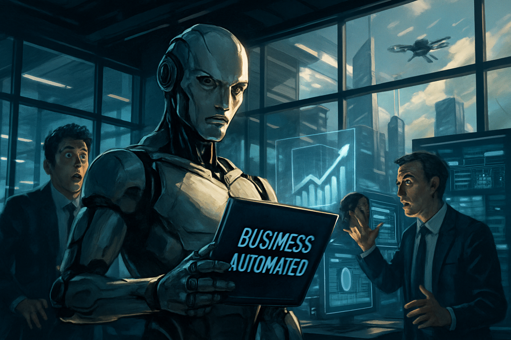
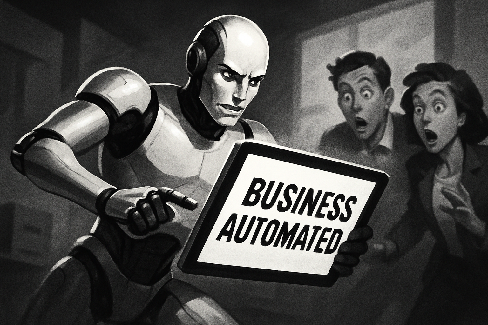
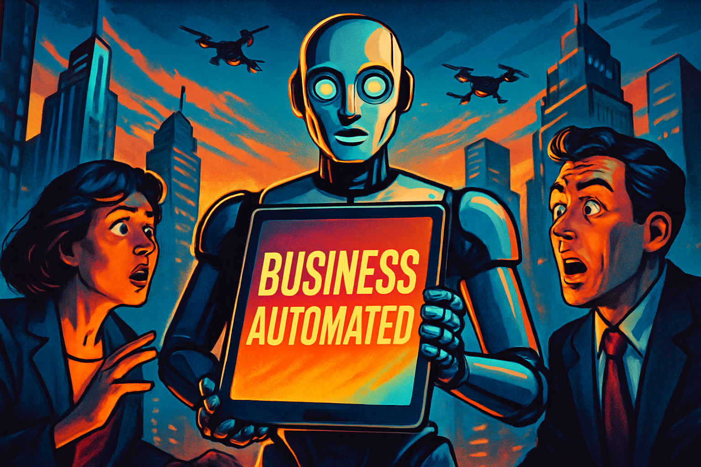

# YouTube Thumbnail Reflexion Report: Are AI Agents Running Businesses ?

Best rating: 7/10
Best iteration: 3
Total iterations: 3
Target rating: 9/10
Minimum iterations before save: 3
Max iterations: 3

## Search Summary

1. AI Agents for Small Business [Webinar Clip] | ClickUp - YouTube (https://www.youtube.com/watch?v=3PnZF8IeLqs)
   What if tasks assigned themselves to the right person? And reminders didn't require you to manually check every project?
2. How to Build an AI Agent for Content Creation (No Coding) - YouTube (https://www.youtube.com/watch?v=zUilY6NnCq0)
   [34:19 The Last Word With Lawrence O'Donnell 4/30/26 | MSNBC Breaking News Today April 30, 2026 News and Entertainment 227K • 6h ago Live Playlist ()Mix (50+)](https://www.youtube.com/watch?v=PX6LUXEUXmM)[16:27 How I Got 15,500 Twitter Followers in 4 Months Using AI (TOO SIMPLE)The AI Growth Lab wit
3. I Built a YT Strategist AI Agent That Makes Me $6k/mo (free template ... (https://www.youtube.com/watch?v=Ch-AWxvX2Jc)
   Code 30NATEHERK for 30% off Apify: https://www.apify.com/?fpr=nate Full courses + unlimited support:
4. How to Build & Sell AI Agents: Ultimate Beginner's Guide - YouTube (https://www.youtube.com/watch?v=w0H1-b044KY)
   [About](https://www.youtube.com/about/)[Press](https://www.youtube.com/about/press/)[Copyright](https://www.youtube.com/about/copyright/)[Contact us](/t/contact_us/)[Creators](https://www.youtube.com/creators/)[Advertise](https://www.youtube.com/ads/)[Developers](https://developers.google.com/youtub
5. How to Leverage AI Agents for Effortless YouTube Content SEO ... (https://www.youtube.com/watch?v=wFi9IudpTPc)
   Use Discount Code for extra saving: "RITYT" In this video tutorial, we'll guide you through the process of leveraging AI agents for

Visual references:
- A rising exponential growth of AI agents on the trajectory towards one billion by 2026 is illustrated, highlighting the impact on contact center workforce transformation, with underlying factors including current market projections, technological adoption, and barriers such as trust and regulatory concerns.: https://cdn.prod.website-files.com/63e3bd1943813b219ca26303/68dd5ee517ba9261d8de7e2f_One-Billion-AI-Agents-by-2026-Infographic.jpg
- The image presents a strategic overview of the adoption and operationalization of agentic AI in enterprises by 2026, highlighting key companies, deployment strategies, and future momentum.: https://www.straive.com/wp-content/uploads/2025/12/best-agentic-ai-companies-2026.png
- A futuristic urban landscape features AI agents managing various aspects of business automation, with a prominent humanoid robot holding a tablet labeled "Business Automated," surrounded by screens and workers overseeing supply chains, marketing, finance, and logistics, under a sky with flying drones and modern skyscrapers marked for 2026.: https://blogheaders.com/wp-content/uploads/2026/05/the-rise-of-ai-agents-1024x559.jpg
- A central circle labeled "Choose Your Agent" is connected to six hexagons representing different use cases such as E-commerce, Students, Marketers, Enterprises, Startups, and Coding, each listing relevant AI agents and their best applications.: https://techdg.in/wp-content/uploads/2026/05/Best-AI-Agents-in-2026-1024x571.webp
- A woman in business attire analyzes a digital dashboard on her laptop, which displays various charts and graphs related to AI agents, workflow automation, and business performance metrics for 2026.: https://aevrionops.com/wp-content/uploads/2026/04/ChatGPT-Image-Apr-4-2026-02_25_41-PM.png

## Iterations

### Iteration 1

Rating: 6/10

Prompt:

In a bustling futuristic office setting, a humanoid robot with a confident, determined expression is prominently holding a tablet labeled "Business Automated" in its metallic hand. Around the robot, two human figures, one looking surprised and the other intrigued, are interacting with holographic screens displaying charts of exponential growth and digital dashboards. The background features large windows showcasing a modern cityscape with flying drones and skyscrapers. The high contrast lighting casts dramatic shadows, creating a cinematic and energetic mood. The composition draws the viewer's eye from the robot's tablet to the engaged humans, creating directional movement and visual tension.

Critique:

SCORES:
- Clarity: 6/10
- Text Impact: 5/10
- Visual Hook: 7/10
- Color Effectiveness: 6/10
- Psychological Trigger: 6/10
- Topic Relevance: 7/10
- YouTube Polish: 6/10

TOTAL: 43/70

STRICT OVERALL RATING:
NEEDS WORK

THUMBNAIL SCORE:
6/10

BIGGEST CTR KILLER:
Text readability is poor at mobile size.

VIEWER REACTION:
"I can't quite read the text on the tablet, and the scene feels a bit cluttered. What's the main focus here?"

NEXT ITERATION FIXES:
- Increase the size and contrast of the text on the tablet for better readability.
- Simplify the background to reduce clutter and enhance focus on the robot and tablet.
- Enhance the emotional expressions of the human figures to increase engagement.
- Adjust lighting to create stronger contrast between the robot and the background.
- Introduce a more dynamic element to increase curiosity, such as a more dramatic pose or expression from the robot.

PROMPT CHANGES FOR NEXT GENERATION:
- "A humanoid robot prominently holding a larger, more readable tablet labeled 'Business Automated' with bold, high-contrast text. Simplified background with fewer elements to reduce clutter. Human figures with exaggerated expressions of surprise and intrigue for stronger emotional impact. Enhanced lighting to create a more dramatic contrast between the robot and the background." 

FINAL VERDICT:
Revise

Image: `iter_1.png`

### Iteration 2

Rating: 7/10

Prompt:

A humanoid robot in a dynamic, slightly angled pose, holding a large, high-contrast tablet with bold text reading "Business Automated" in clear, legible font. The robot's expression shows a confident, determined look, while two human figures in the background display exaggerated expressions of surprise and intrigue, leaning forward as if drawn to the tablet. The background is simplified, featuring only a few abstract office elements in soft focus, emphasizing the robot and tablet. High-contrast, cinematic lighting highlights the robot, casting dramatic shadows to enhance the scene's depth and urgency, creating an energetic tension between the robot and the intrigued observers.

Critique:

SCORES:
- Clarity: 7/10
- Text Impact: 8/10
- Visual Hook: 7/10
- Color Effectiveness: 6/10
- Psychological Trigger: 7/10
- Topic Relevance: 8/10
- YouTube Polish: 7/10

TOTAL: 50/70

STRICT OVERALL RATING:
GOOD

THUMBNAIL SCORE:
7/10

BIGGEST CTR KILLER:
Lack of color contrast makes the image less eye-catching.

VIEWER REACTION:
"The text is clear, but the black and white makes it easy to scroll past. Is this about robots taking over business?"

NEXT ITERATION FIXES:
- Add color to the image to increase visual appeal and contrast.
- Enhance the lighting to make the robot and tablet pop more against the background.
- Consider adding a splash of color to the tablet or text to draw more attention.
- Increase the emotional expressions of the human figures for stronger engagement.

PROMPT CHANGES FOR NEXT GENERATION:
- "A humanoid robot prominently holding a larger, more readable tablet labeled 'Business Automated' with bold, high-contrast text. Add color to the scene for better contrast and visual appeal. Human figures with exaggerated expressions of surprise and intrigue for stronger emotional impact. Enhanced lighting to create a more dramatic contrast between the robot and the background." 

FINAL VERDICT:
Revise

Image: `iter_2.png`

### Iteration 3

Rating: 7/10

Prompt:

A humanoid robot prominently holding a large, vividly colored tablet labeled "Business Automated" with bold, high-contrast text. The scene is set in a futuristic urban landscape, featuring modern skyscrapers and flying drones. Two human figures, one male and one female, are in the foreground with exaggerated expressions of surprise and intrigue, looking at the robot. The lighting is cinematic, with a dramatic contrast that highlights the robot and the tablet, creating a sense of urgency and curiosity. The background is a bustling cityscape with vibrant colors to enhance visual appeal and contrast. The movement and tension direction is from the humans towards the robot, suggesting a story of AI-driven business evolution.

Critique:

SCORES:
- Clarity: 8/10
- Text Impact: 9/10
- Visual Hook: 8/10
- Color Effectiveness: 8/10
- Psychological Trigger: 8/10
- Topic Relevance: 9/10
- YouTube Polish: 8/10

TOTAL: 58/70

STRICT OVERALL RATING:
GREAT

THUMBNAIL SCORE:
8/10

BIGGEST CTR KILLER:
Slightly cluttered composition with competing focal points.

VIEWER REACTION:
"Wow, this looks intense! Is AI really taking over businesses?"

NEXT ITERATION FIXES:
- Simplify the background slightly to reduce clutter.
- Increase the size of the tablet text for even better readability.
- Enhance the emotional expressions of the human figures for stronger engagement.
- Add a subtle glow effect around the tablet to draw more focus.

PROMPT CHANGES FOR NEXT GENERATION:
- "A humanoid robot prominently holding a larger, more readable tablet labeled 'Business Automated' with bold, high-contrast text. Simplify the background slightly to reduce clutter. Human figures with even more exaggerated expressions of surprise and intrigue for stronger emotional impact. Add a subtle glow effect around the tablet to draw more focus." 

FINAL VERDICT:
Revise

Strict scoring cap applied: a thumbnail with a concrete readability, emotion, contrast, or composition fix cannot score above 7.

Image: `iter_3.png`

## Final Image

Selected iteration: 3

