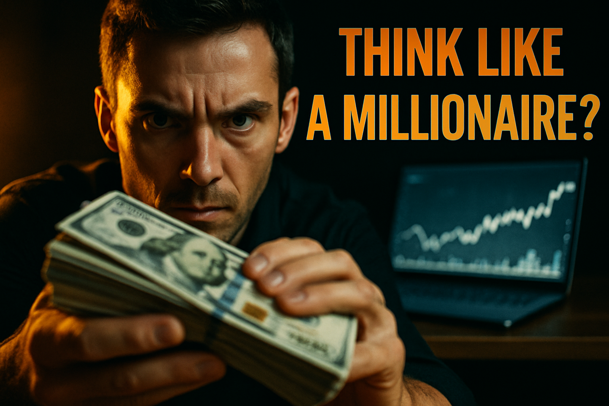

# YouTube Thumbnail Reflexion Report: How Millionaires Think Differently ?

Best rating: 7/10
Best iteration: 2
Total iterations: 3
Target rating: 9/10
Minimum iterations before save: 3
Max iterations: 3

## Search Summary

1. The New Thumbnail Strategy Dominating YouTube in 2026 (https://www.youtube.com/watch?v=TY4cm66X_oY)
   The New Thumbnail Strategy Dominating YouTube in 2026
Dan the creator
305000 subscribers
149 likes
1574 views
22 May 2026
Get 50% off my Titles & Thumbnails Mastery here: https://www.ytwealthacademy.org/titlesandthumbnails

Learn how to make better YouTube thumbnails using human psychology, emotiona
2. 10 Mindset Shifts That Will Make You A Millionaire - YouTube (https://www.youtube.com/watch?v=Ef5w1MUgy7g)
   ... thinking differently than the majority of people" ~Jaspreet Singh My ... Video host: Jaspreet Singh DISCLAIMER: This description may
3. How to Grow on YouTube in 2026 | Thumbnail, Title & Hook Strategy That Works (https://www.youtube.com/watch?v=cVzkvgsJHpU)
   How to Grow on YouTube in 2026 | Thumbnail, Title & Hook Strategy That Works
BrandMeVisual
7470 subscribers
1 likes
2 views
21 May 2026
Want to know how to grow on YouTube in 2026 without wasting months posting videos that nobody clicks? In this video, I break down the real YouTube growth strategy t
4. Seven Mindset Shifts That Made Me Millions - YouTube (https://www.youtube.com/watch?v=x3TbOrkbUR8)
   Becoming a millionaire ... The way you think determines the way you act, and the way you act determines the results you create. In this video
5. 4 Hooks That Get Millions of Views Every Time (Use These Now) (https://www.youtube.com/watch?v=pQcV5j0xazk)
   Video Formats & Hooks Sheet: https://drive.google.com/drive/folders/1o5T7Qq9I-z6Cuw1msoAomCO3KccqUCqi In this video, I reveal the 4 hook

Visual references:
- A confident woman with sunglasses and pink lipstick points at a vibrant thumbnail emphasizing YouTube growth strategies for 2026.: https://i.ytimg.com/vi/cVzkvgsJHpU/hq720.jpg?sqp=-oaymwEhCK4FEIIDSFryq4qpAxMIARUAAAAAGAElAADIQj0AgKJD&rs=AOn4CLBpIbvwm7qsfDgWzMBpZAbAG20r0A
- No description: https://lookaside.instagram.com/seo/google_widget/crawler/?media_id=3891831593119873940
- No description: https://lookaside.instagram.com/seo/google_widget/crawler/?media_id=3885985956159767700
- No description: https://lookaside.instagram.com/seo/google_widget/crawler/?media_id=3881407712508584791
- No description: https://lookaside.instagram.com/seo/google_widget/crawler/?media_id=3784617958846018435

## Iterations

### Iteration 1

Rating: 6/10

Prompt:

A close-up of a confident man in a sharp suit with a subtle, knowing smirk on his face, looking directly at the camera with intense eyes, suggesting insight and success. The background is a luxurious office setting with a large window showing a city skyline at sunset, casting a golden glow across the room. In the foreground, there's a stack of crisp $100 bills partially obscured by a sleek laptop, implying wealth and technology. High contrast with dramatic lighting emphasizes the man's expression and the rich colors of the sunset. The mood is aspirational and enigmatic, creating tension as the viewer wonders about the secrets to his success.

Critique:

SCORES:
- Clarity: 7/10
- Text Impact: 0/10 (No text present)
- Visual Hook: 6/10
- Color Effectiveness: 7/10
- Psychological Trigger: 6/10
- Topic Relevance: 7/10
- YouTube Polish: 6/10

TOTAL: 39/70

STRICT OVERALL RATING:
NEEDS WORK

THUMBNAIL SCORE:
6/10

BIGGEST CTR KILLER:
Lack of text or clear curiosity element.

VIEWER REACTION:
"Looks nice, but what’s the video about?"

NEXT ITERATION FIXES:
- Add a short, curiosity-driven text overlay.
- Increase contrast on the man's face to make it pop more.
- Introduce a more dynamic element to create tension or surprise.
- Ensure the money and laptop are more prominent to emphasize wealth.
- Consider adding a subtle question mark or symbol to suggest mystery.

PROMPT CHANGES FOR NEXT GENERATION:
Include a short, bold text overlay that reads "Think Like a Millionaire?" in a contrasting color. Ensure the man's expression is more intense and the money stack is more prominent in the foreground.

FINAL VERDICT:
Revise

Image: `iter_1.png`

### Iteration 2

Rating: 7/10

Prompt:

A close-up of a man with an intense, focused expression, his eyes wide with determination, holding a stack of cash prominently in the foreground. The cash is vividly detailed, with crisp edges and shadows enhancing its prominence. In the background, a sleek, modern laptop screen glows with financial graphs, suggesting wealth and digital success. A bold, large text overlay in a striking contrasting color reads, "Think Like a Millionaire?" with a subtle question mark to intrigue viewers. The entire scene is bathed in high contrast, cinematic lighting, with a warm glow highlighting the man's face and the cash, creating a sense of urgency and tension. The background is slightly blurred to ensure strong foreground and background separation, drawing immediate focus to the man and the cash.

Critique:

SCORES:
- Clarity: 8/10
- Text Impact: 7/10
- Visual Hook: 7/10
- Color Effectiveness: 7/10
- Psychological Trigger: 6/10
- Topic Relevance: 8/10
- YouTube Polish: 7/10

TOTAL: 50/70

STRICT OVERALL RATING:
GOOD

THUMBNAIL SCORE:
7/10

BIGGEST CTR KILLER:
Lack of strong emotional expression or dynamic tension.

VIEWER REACTION:
"Interesting, but does it really show how millionaires think?"

NEXT ITERATION FIXES:
- Increase the intensity of the man's expression to convey more determination or intrigue.
- Add a subtle element of surprise or mystery, such as a question mark or symbol.
- Enhance the contrast between the foreground and background to make the cash and laptop pop more.
- Consider using a more dynamic angle or composition to create movement.

PROMPT CHANGES FOR NEXT GENERATION:
Ensure the man's expression is more intense and dynamic. Add a subtle question mark or symbol to suggest mystery. Enhance the contrast between the foreground and background to make the cash and laptop more prominent.

FINAL VERDICT:
Revise

Image: `iter_2.png`

### Iteration 3

Rating: 6/10

Prompt:

A middle-aged man with intense determination in his eyes, leaning forward with a slight smirk, surrounded by stacks of cash on one side and a laptop on the other. His expression suggests he's deep in thought, plotting his next move. A translucent question mark hovers above his head, adding an element of mystery. The background is a blurred cityscape at dusk, with warm, cinematic lighting casting dramatic shadows. The cash and laptop are sharply in focus, creating a strong contrast with the softened backdrop, drawing the viewer's eye to these symbols of wealth and strategy. The composition is angled, creating a sense of movement from left to right, enhancing the dynamic tension in the scene.

Critique:

SCORES:
- Clarity: 7/10
- Text Impact: 5/10
- Visual Hook: 6/10
- Color Effectiveness: 7/10
- Psychological Trigger: 6/10
- Topic Relevance: 7/10
- YouTube Polish: 6/10

TOTAL: 44/70

STRICT OVERALL RATING:
NEEDS WORK

THUMBNAIL SCORE:
6/10

BIGGEST CTR KILLER:
Lack of strong emotional expression or dynamic tension.

VIEWER REACTION:
"Looks interesting, but I'm not sure what the question mark is about."

NEXT ITERATION FIXES:
- Increase the intensity of the man's expression to convey more determination or intrigue.
- Make the question mark more prominent and integrated into the scene.
- Enhance the contrast between the foreground and background to make the cash and laptop pop more.
- Consider using a more dynamic angle or composition to create movement.

PROMPT CHANGES FOR NEXT GENERATION:
Ensure the man's expression is more intense and dynamic. Make the question mark larger and more integrated. Enhance the contrast between the foreground and background to make the cash and laptop more prominent.

FINAL VERDICT:
Revise

Image: `iter_3.png`

## Final Image

Selected iteration: 2

