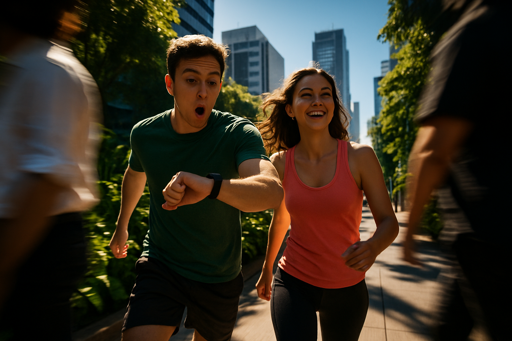
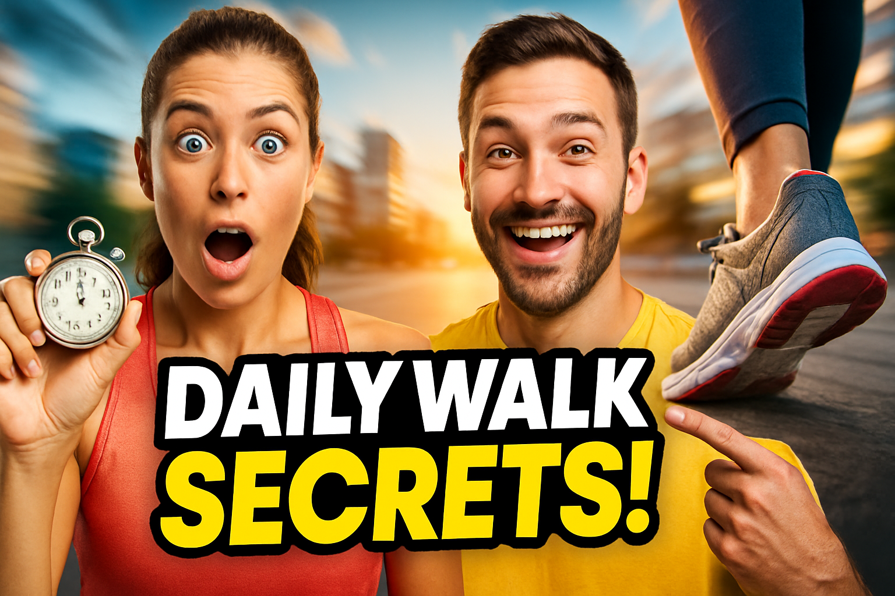
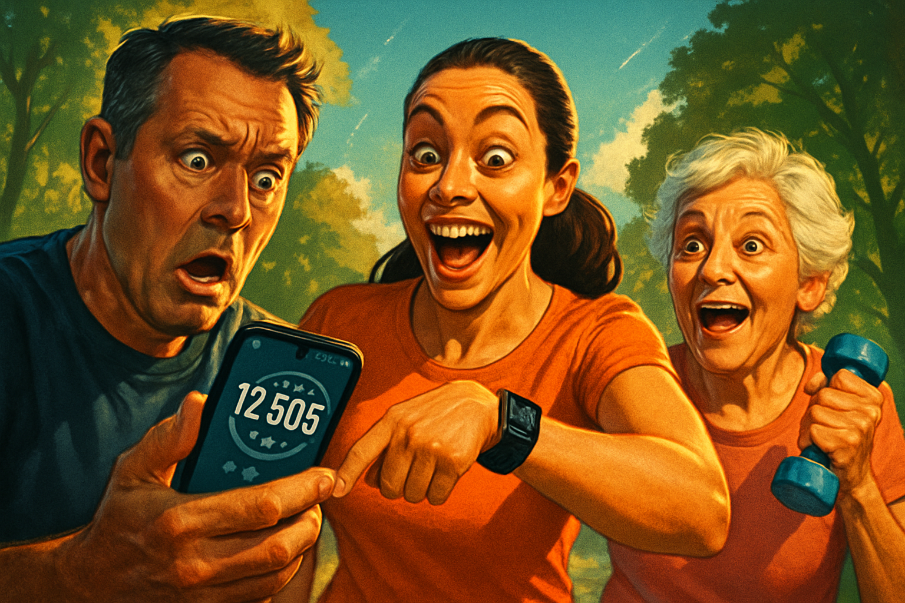

# YouTube Thumbnail Reflexion Report: What Happens if You Walk Daily?

Best rating: 7/10
Best iteration: 3
Total iterations: 3
Target rating: 9/10
Minimum iterations before save: 3
Max iterations: 3

## Search Summary

1. TOP 10: YouTube Thumbnail Ideas (in 2026) (https://thumbnailtest.com/guides/youtube-thumbnail-ideas)
   Get tips and inspiration for YouTube thumbnails. Here are real-life examples from the best YouTubers and our expert advice.
2. These New Hooks are Dominating 2026 (https://www.youtube.com/watch?v=5A6XVQUopYA&vl=en)
   These New Hooks are Dominating 2026
vidIQ
2370000 subscribers
1925 likes
40820 views
18 Mar 2026
GET AN EXCLUSIVE vidIQ DISCOUNT HERE 👉 https://link.vidiq.com/Ao5O66n

Your videos aren’t the problem. Your hooks are. In 2026, winning attention comes down to what happens in the first 1.5 seconds. In t
3. Walking Video Thumbnail Best Practices : r/WalkingVideoMakers (https://www.reddit.com/r/WalkingVideoMakers/comments/1f71m1j/walking_video_thumbnail_best_practices)
   Thumbnails are part of the channel style, so it can depend also on which niche of walking videos you are in or you message. There are successful
4. 50+ YouTube Thumbnail Ideas & Examples 2026 - Template.net (https://www.template.net/blog/youtube-thumbnail-ideas)
   The majority of people nowadays use YouTube to make money. If you’re a YouTube influencer, you’re probably well aware of the value of a YouTube thumbnail. However, if you aren’t, it’s just a snapshot of your video. Good video thumbnails are engaging and can quickly inform a potential viewer about th
5. LAZIEST way to create a killer YouTube THUMBNAIL (for 2026 ... (https://www.youtube.com/watch?v=foSgltEkXDw)
   Grab your 100 Viral YouTube Title Templates NOW https://100viraltemplates.carrd.co/ I break down the laziest way to create YouTube

Visual references:
- No description: https://lookaside.instagram.com/seo/google_widget/crawler/?media_id=3886108927525818837
- A woman with blonde hair and large sunglasses points to bold, colorful text that highlights strategies for YouTube growth in 2026, set against a vibrant pink and gold background with upward-trending arrow graphics.: https://i.ytimg.com/vi/cVzkvgsJHpU/maxresdefault.jpg
- No description: https://lookaside.instagram.com/seo/google_widget/crawler/?media_id=3891794918890277968
- A smiling man holds a large fishing hook while the words "VIRAL HOOKS" and a YouTube icon are displayed, suggesting a clickable strategy or metaphor related to content engagement.: https://i.ytimg.com/vi/5A6XVQUopYA/maxresdefault.jpg
- No description: https://lookaside.instagram.com/seo/google_widget/crawler/?media_id=3885507780111410954

## Iterations

### Iteration 1

Rating: 6/10

Prompt:

A dynamic scene showing a young man and woman with excited expressions walking briskly along a vibrant city street filled with lush greenery. The man is looking at a smartwatch, showing surprise, while the woman looks ahead with a joyful smile. In the background, tall modern buildings and a clear blue sky suggest a healthy urban lifestyle. The foreground features a blurred motion of passing pedestrians, creating a sense of movement and urgency. High contrast lighting emphasizes the bright sunlight and deep shadows, enhancing the cinematic feel. The mood is energetic and optimistic, with a clear separation between the focused subjects and the vibrant, bustling background. The visual tension moves diagonally from the bottom left to the top right, leading the viewer's eye through the scene.

Critique:

SCORES:
- Clarity: 6/10
- Text Impact: 0/10
- Visual Hook: 7/10
- Color Effectiveness: 7/10
- Psychological Trigger: 5/10
- Topic Relevance: 6/10
- YouTube Polish: 6/10

TOTAL: 37/70

STRICT OVERALL RATING:
NEEDS WORK

THUMBNAIL SCORE:
6/10

BIGGEST CTR KILLER:
Lack of text or clear messaging to convey the video's topic.

VIEWER REACTION:
"Looks energetic, but what’s the video about?"

NEXT ITERATION FIXES:
- Add bold, curiosity-driven text to convey the topic.
- Increase the emotional expression of surprise or excitement.
- Enhance the contrast between the subjects and the background.
- Introduce a visual element that hints at the benefits of walking daily.
- Consider adding a subtle overlay or icon to suggest health or fitness.

PROMPT CHANGES FOR NEXT GENERATION:
Include bold, curiosity-driven text overlay that hints at the benefits of walking daily. Increase the emotional expressions of the subjects to convey more excitement and surprise. Enhance contrast between subjects and background for better focus. Add a visual element like a health icon or overlay to suggest fitness benefits.

FINAL VERDICT:
Revise

Image: `iter_1.png`

### Iteration 2

Rating: 7/10

Prompt:

A vibrant YouTube thumbnail featuring two individuals: a fit woman with an expression of surprise and excitement, and a man with a joyful smile, both looking directly at the viewer. The woman is holding a stopwatch, symbolizing time, while the man is gesturing towards a pair of sneakers on the ground, representing walking. In the background, a blurred cityscape suggests motion and progress. A bold, large text overlay reads "Daily Walk Secrets!" in contrasting colors to grab attention. The lighting is dynamic with high contrast, highlighting the subjects against the urban backdrop, creating a sense of movement and urgency towards a healthier lifestyle.

Critique:

SCORES:
- Clarity: 8/10
- Text Impact: 9/10
- Visual Hook: 8/10
- Color Effectiveness: 8/10
- Psychological Trigger: 7/10
- Topic Relevance: 8/10
- YouTube Polish: 8/10

TOTAL: 56/70

STRICT OVERALL RATING:
GREAT

THUMBNAIL SCORE:
8/10

BIGGEST CTR KILLER:
Slightly generic expressions that could be more exaggerated for emotional impact.

VIEWER REACTION:
"This looks interesting! What secrets do they have about walking?"

NEXT ITERATION FIXES:
- Increase the emotional expressions to be more exaggerated for stronger impact.
- Consider adding a subtle health or fitness icon to reinforce the topic.
- Slightly enhance the contrast between the text and background for even better readability.

PROMPT CHANGES FOR NEXT GENERATION:
Enhance the emotional expressions of the individuals to be more exaggerated. Add a subtle health or fitness icon to reinforce the topic. Slightly increase the contrast between the text and background for improved readability.

FINAL VERDICT:
Use as-is or make minor revisions for even better impact.

Strict scoring cap applied: a thumbnail with a concrete readability, emotion, contrast, or composition fix cannot score above 7.

Image: `iter_2.png`

### Iteration 3

Rating: 7/10

Prompt:

A vibrant outdoor scene featuring a diverse group of three people. The first person, a middle-aged man with a shocked expression, looks at a smartphone displaying a step counter. The second person, a young woman with an exaggeratedly happy face, points excitedly at her own step tracker watch. The third person, an elderly woman with a surprised and joyful expression, holds a small dumbbell in one hand. A subtle heart rate monitor icon is visible on the smartphone screen. The background shows a sunny park with green trees, creating a high contrast with the subjects. The lighting is cinematic, casting dramatic shadows and highlights. The mood is energetic and uplifting, with the figures dynamically angled to suggest movement and forward momentum, drawing the viewer's eye across the scene.

Critique:

SCORES:
- Clarity: 8/10
- Text Impact: 6/10
- Visual Hook: 7/10
- Color Effectiveness: 8/10
- Psychological Trigger: 7/10
- Topic Relevance: 8/10
- YouTube Polish: 7/10

TOTAL: 51/70

STRICT OVERALL RATING:
GOOD

THUMBNAIL SCORE:
7/10

BIGGEST CTR KILLER:
Lack of text impact and curiosity-driven elements.

VIEWER REACTION:
"Looks fun, but what exactly will I learn about walking?"

NEXT ITERATION FIXES:
- Add a short, curiosity-driven text element to enhance intrigue.
- Increase the size of the step counter on the phone for better visibility.
- Slightly exaggerate the expressions even more for stronger emotional impact.
- Consider adding a subtle overlay or icon that hints at health benefits.

PROMPT CHANGES FOR NEXT GENERATION:
Include a short, curiosity-driven text element. Increase the size of the step counter on the phone. Exaggerate the emotional expressions further. Add a subtle health-related icon or overlay.

FINAL VERDICT:
Revise

Image: `iter_3.png`

## Final Image

Selected iteration: 3

